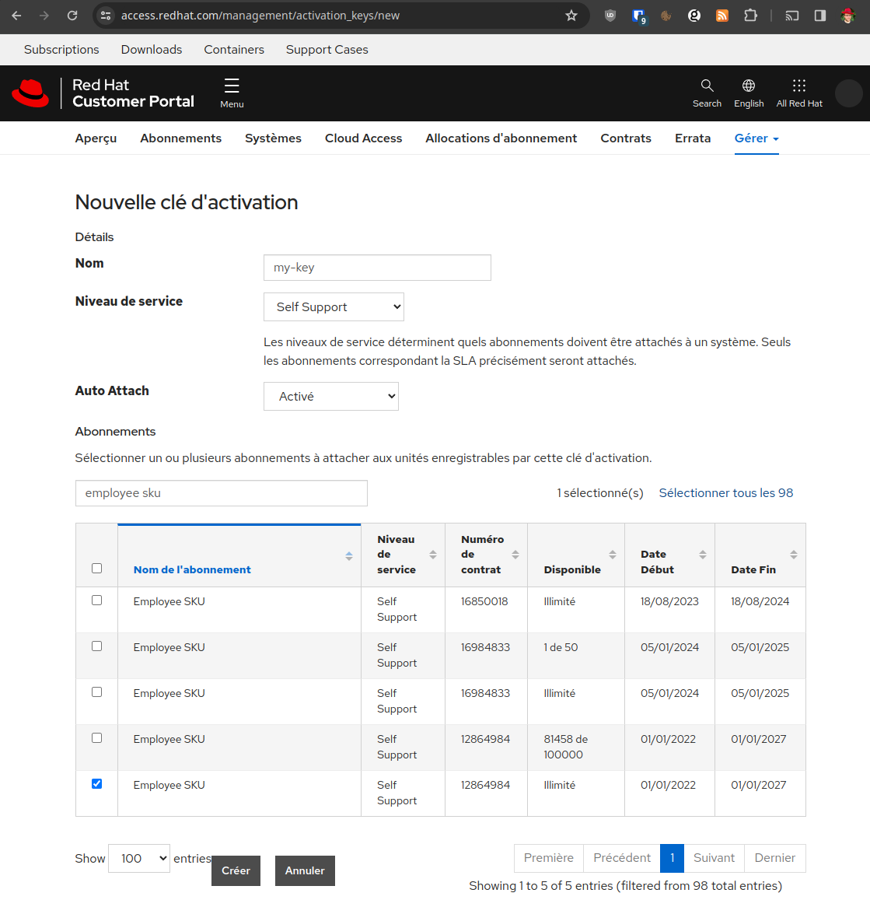

# ARM64 virtual machine

## Pre-requisites

On your workstation:

- Terraform
- Bash
- AWS CLI

Create an [activation key](https://access.redhat.com/management/activation_keys).



## Configure access to your AWS tenant

```sh
aws configure
```

## S3 Bucket

Create an S3 bucket to host your custom RPM.

```sh
sudo dnf install -y rclone awscli2
S3_BUCKET_NAME="demo-ai-edge-crazy-train-custom-repo"
aws s3api create-bucket --bucket "$S3_BUCKET_NAME" --create-bucket-configuration LocationConstraint=eu-west-3 --region eu-west-3
aws s3api put-bucket-tagging --bucket "$S3_BUCKET_NAME" --tagging "TagSet=[{Key=Name,Value=$S3_BUCKET_NAME}]"
ACCESS_KEY_ID="$(aws configure export-credentials | jq -r .AccessKeyId)"
SECRET_ACCESS_KEY="$(aws configure export-credentials | jq -r .SecretAccessKey)"
rclone config create demo-ai-edge-crazy-train s3 provider=AWS access_key_id="$ACCESS_KEY_ID" secret_access_key="$SECRET_ACCESS_KEY" region="eu-west-3"
rclone ls demo-ai-edge-crazy-train:$S3_BUCKET_NAME
rclone sync --include '*.rpm' /path/to/jetpack-rpms/ demo-ai-edge-crazy-train:$S3_BUCKET_NAME/
```

## VM Deployment

```sh
cat > terraform.tfvars <<EOF
route53_zone = "sandbox566.opentlc.com."
s3_bucket_name = "$S3_BUCKET_NAME"
EOF
./prepare-cloud-init.sh
terraform init
terraform apply
```

## Post-install configuration

```sh

```